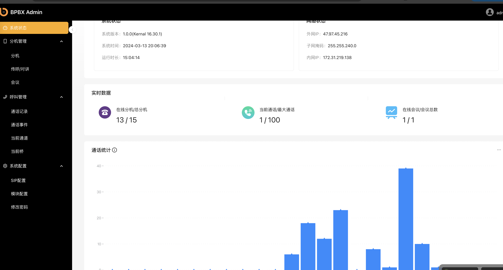

# 简介

BPBX是一款基于轻量级的PBX系统。旨在为企业提供高效、稳定、灵活的通信解决方案，满足企业日常通信需求，提升工作效率。BPBX支持多种通信协议，具备丰富的功能特性，可轻松实现语音通话、传真、会议、呼叫转移等多种通信服务。

## 功能特点

**高稳定性**
BPBX采用`C`底层驱动作为核心引擎，具备高可靠性和稳定性，确保企业通信的畅通无阻。

**灵活扩展**

BPBX支持模块化设计，可根据企业需求灵活扩展功能模块，满足企业不断发展的通信需求。

**多协议支持**

BPBX支持SIP、IAX2、H.323等多种通信协议，可与多种通信设备进行互联互通。

**丰富的功能特性**

BPBX提供语音通话、传真、会议、呼叫转移、呼叫限制、呼叫排队等多种功能，满足企业多样化的通信需求。

**易于管理**

BPBX提供友好的管理界面，方便管理员进行设备配置、用户管理、通话记录查询等操作。

## 功能模块

| 仪表盘            |                                     |                                                   |
| ----------------- | ----------------------------------- | ------------------------------------------------- |
|                   | 系统状态                            | 显示软件及系统版本及运行时间                      |
|                   | 网络状态                            | 显示服务器网络信息                                |
|                   | 实时状态                            | 实时显示在线分机，在线                            |
|                   | 通话统计                            | 统计24小时内通话数量                              |
| **分机管理**      |                                     |                                                   |
|                   | 分机列表                            | 显示分机的配置，在线状态，注册信息等              |
|                   | 创建/编辑/删除分机（支持批量）      | 对分机进行配置管理                                |
| **传呼/对讲管理** |                                     |                                                   |
|                   | 对讲列表                            | 显示对讲组的配置，成员等                          |
|                   | 创建/编辑/删除对讲（支持批量）      | 对对讲进行配置管理                                |
| **会议管理**      |                                     |                                                   |
|                   | 会议列表                            | 显示会议配置，状态，成员等信息                    |
|                   | 创建/编辑/删除/锁定会议（支持批量） | 对会议进行配置管理                                |
|                   | 邀请/踢出成员                       | 邀请或踢出会议成员                                |
|                   | 静音/取消静音成员                   | 对会议成员进行静音 取消静音操作                   |
| **通话管理**      |                                     |                                                   |
|                   | 通话列表（CDR）                     | 显示PBX的通话记录，可以下载对应的通话录音         |
|                   | 通话事件 (CEL)                      | 显示PBX的通话事件日志，方便进行排查和定位         |
|                   | 当前通话                            | 显示PBX目前正在进行的通话信息，可以对通话进行挂断 |
| **系统配置**      |                                     |                                                   |
|                   | SIP配置                             | 可以对PBX的网络，协议等其他相关参数进行配置       |
|                   | 模块配置                            | 可以对PBX内置的各种模块进行加载，卸载等操作       |

## 应用场景

BPBX作为一款功能强大的PBX系统，具有广泛的应用场景。以下是根据其特点，分类并附上说明的可应用场景：

**呼叫中心**

BPBX系统非常适合应用于呼叫中心环境。它支持大量并发呼叫的处理，可以确保呼叫的畅通无阻。同时，BPBX具备高效的呼叫排队、呼叫转移和呼叫记录功能，帮助呼叫中心工作人员有效地管理呼叫流程，提高服务效率。通过BPBX系统，呼叫中心能够快速响应客户需求，提供优质的客户服务体验。

**广播调度**

BPBX在广播调度领域也有着广泛的应用。其具备的高可靠性和稳定性保证了广播信号的持续传输。通过BPBX系统，广播调度中心可以实现与其他部门或分站的实时通信，确保信息的及时传递和准确调度。此外，BPBX还支持广播内容的录制和回放功能，方便后续管理和审计。

**会议系统**

BPBX系统非常适合作为会议系统的通信解决方案。它支持多方通话和会议功能，可以方便地组织线上或线下的会议活动。通过BPBX系统，参会人员可以实时进行语音交流，共享文档和屏幕，提高会议效率。此外，BPBX还支持会议录音和会议记录功能，方便后续整理和总结会议内容。

## 技术架构

**底层**

基于`C`内核驱动，采用`ARA`架构设计

**应用层**

基于SpringBoot3.x框架， `Spring boot Security` + `JPA` + `RESETful` 的接口设计

**数据库**

关系数据库`Mariadb`， 缓存数据库  `Redis`

**前端**

基于`ReactJS` ， `Antd Pro v5`框架

## 试用购买

如果你对BPBX感兴趣，或者有类似项目定制需求，可以联系微信号 `foxmee` （张晓刚-云字节）进行试用或购买。

如果像基于BPBX进行二次开发，也可以通过[BSF基金会](https://byteee.fund/project/bpbx)购买相关代码

