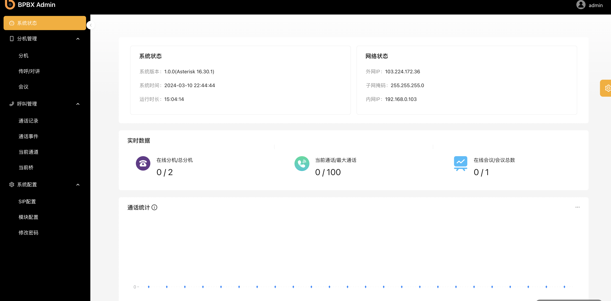

# BPBX介绍

BPBX是一款基于Asterisk+JAVA设计的PBX系统。旨在为企业提供高效、稳定、灵活的通信解决方案，满足企业日常通信需求，提升工作效率。BPBX支持多种通信协议，具备丰富的功能特性，可轻松实现语音通话、传真、会议、呼叫转移等多种通信服务。

## 功能特点

**高稳定性**
BPBX采用Asterisk作为核心引擎，具备高可靠性和稳定性，确保企业通信的畅通无阻。

**灵活扩展**

BPBX支持模块化设计，可根据企业需求灵活扩展功能模块，满足企业不断发展的通信需求。

**多协议支持**

BPBX支持SIP、IAX2、H.323等多种通信协议，可与多种通信设备进行互联互通。

**丰富的功能特性**

BPBX提供语音通话、传真、会议、呼叫转移、呼叫限制、呼叫排队等多种功能，满足企业多样化的通信需求。

**易于管理**

BPBX提供友好的管理界面，方便管理员进行设备配置、用户管理、通话记录查询等操作。

## 功能模块

**分机**

基于`chan_sip`驱动进行创建，可实时查看分机状态及注册歇息

**对讲/传呼**

可以创建对讲组，批量呼叫

**会议**

创建会议，管理会议成员，邀请，禁言，踢出等操作

**通话**

记录通过记录`cdr`，通话事件`cel`，以及当前的通话通道及录音。

**监控**

监控在线分机，当前通话及会议等状态的监控

## 应用场景

BPBX作为一款功能强大的PBX系统，具有广泛的应用场景。以下是根据其特点，分类并附上说明的可应用场景：

**呼叫中心**

BPBX系统非常适合应用于呼叫中心环境。它支持大量并发呼叫的处理，可以确保呼叫的畅通无阻。同时，BPBX具备高效的呼叫排队、呼叫转移和呼叫记录功能，帮助呼叫中心工作人员有效地管理呼叫流程，提高服务效率。通过BPBX系统，呼叫中心能够快速响应客户需求，提供优质的客户服务体验。

**广播调度**

BPBX在广播调度领域也有着广泛的应用。其具备的高可靠性和稳定性保证了广播信号的持续传输。通过BPBX系统，广播调度中心可以实现与其他部门或分站的实时通信，确保信息的及时传递和准确调度。此外，BPBX还支持广播内容的录制和回放功能，方便后续管理和审计。

**会议系统**

BPBX系统非常适合作为会议系统的通信解决方案。它支持多方通话和会议功能，可以方便地组织线上或线下的会议活动。通过BPBX系统，参会人员可以实时进行语音交流，共享文档和屏幕，提高会议效率。此外，BPBX还支持会议录音和会议记录功能，方便后续整理和总结会议内容。

## 技术架构

**PBX**

基于`Arsterisk` 16.x内核驱动，采用`ARA`（Arsterisk RealTime）架构设计，内置开启`AMI`，`ARI `，`FASTAGI`等接口

**后台**

基于SpringBoot3.x框架， `Spring boot Security` + `JPA` + `RESETful` 的接口设计

**数据库**

关系数据库`Mariadb`， 缓存数据库  `Redis`

**前端**

基于`ReactJS` ， `Antd Pro v5`框架

